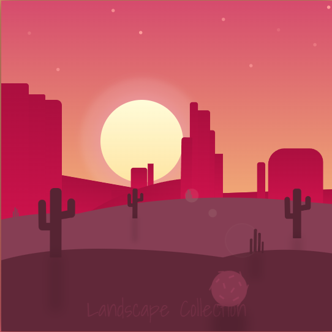
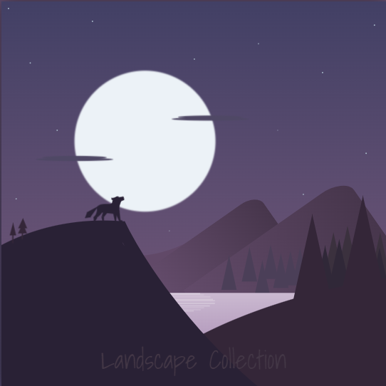

# css-landscapes
Epic artistic landscapes made purely in HTML and CSS/SASS for fun

<table align="center">
  <tr>
    <td align="center">
      <a href="/landscape-desert">
        
        <h3>Desert Sunset</h3>
      </a>
    </td>
    <td align="center">
      <a href="/landscape-whales">
        
        <h3>Whales & Sea</h3>
      </a>
    </td>
    <td align="center">
      <a href="/landscape-wolf">
        
        <h3>Wolf @ Night</h3>
      </a>
    </td>
  </tr>
</table>